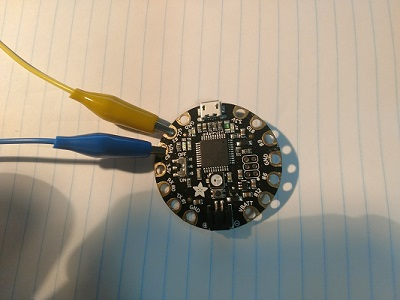
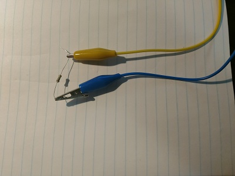
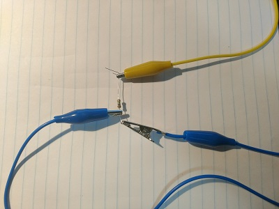
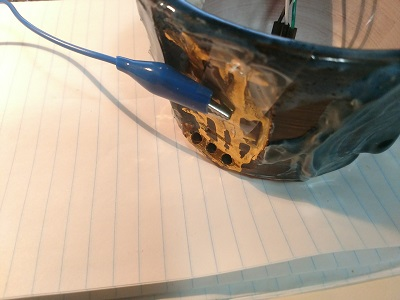
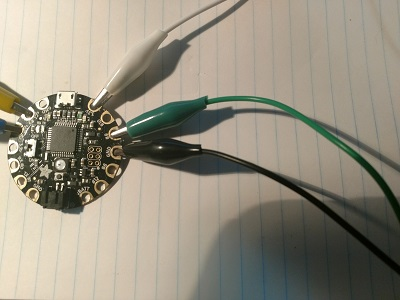

# TouchGlow
Touch a capacative surface, get a response with flashing LED action!  Now with Kung Fu Grip!

## Installation
Before you can compile this sketch, you need to install the board and the code libraries it depends on.

### Installing the Board
This code was written for the Adafruit Flora.  You need to get the appropriate board software!

Getting the Adafruit AVR boards is well documented, [follow the steps at Adafruit](https://learn.adafruit.com/add-boards-arduino-v164/setup)!

### Installing the Libraries
This behavior depends on several libraries.

#### Arduino Library Manager Libraries
Some libraries are easy to install via the Adafruit software.

See [Using the Library Manager](https://www.arduino.cc/en/Guide/Libraries#toc3) for details.
* Adafruit NeoPixel
* CapacativeSensor

#### Manual/Zip Libraries
These libraries will need to be downloaded and installed separately.

First, find out where your libraries should go.  This [guide on manually installing libraries](https://www.arduino.cc/en/Guide/Libraries#toc5) will help with that.

##### TweenDuino
1. Download the [TweenDuino lirbary from Github](https://github.com/stickywes/TweenDuino/archive/dev.zip)
2. Extract its content somewhere temporary.
3. Copy the "TweenDuino-dev" folder's contents into your library's directory.
  * You should have a pool of files like "TweenDuino.h" directly within `libraries/TweenDuino-dev` and not in a subfolder.
  
##### Easing Library
1. Download the [Easing Library](https://drive.google.com/uc?export=download&id=0B9Zobp2aWUKzR0FXYnFMTkQwWHM).
2. Extract its content somewhere temporary.
3. Copy the "TweenDuino-dev" folder's contents into your library's directory.
  * You should have a pool of files like "TweenDuino.h" directly within `libraries/TweenDuino-dev` and not in a subfolder.
  
## Wiring
You'll need to wire up LEDs and the capacative touch sensor.
If you choose to connect wires to different pin numbers, you will need to update the sketch accordingly.
'''
// Name some pins.
const int redLED = 7; // On-board red LED.
const int onBoardLEDPin = 8;  // Flora's NeoPixel is on Pin 8.
const int LEDStripPin = 9; // My pixel strip's data line is on pin 9.
const int capSensorPin = 2;
const int capReadPin = 3;
'''

### Touch Wiring

1. Connect leads to your #3 (blue, in photo) and #2 (yellow, in photo) pins.

2. Connect your leads to opposite ends of a fairly strong resistor (1+ Ohms).

3. Connect another lead to the #3 side of the resistor.

4. Connect that lead to your capacative material.

### LED Wiring

1. Connect leads to your #9, GND, and 3.3V pins.
2. Connect #9 to IN on your LED strip.
3. Connect GND to GND on your LED strip.
4. Connect 3.3V to PWR on your LED strip.

## Fine Tuning Behavior
The specific sensitivity of the capacative surface can vary quite a bit from surface to surface, material to material.

You will want to watch the serial monitor reporting the touch sensor values, and adjust the code to match your desired threshold.
'''
#define TOUCH_THRESHOLD 300
'''
